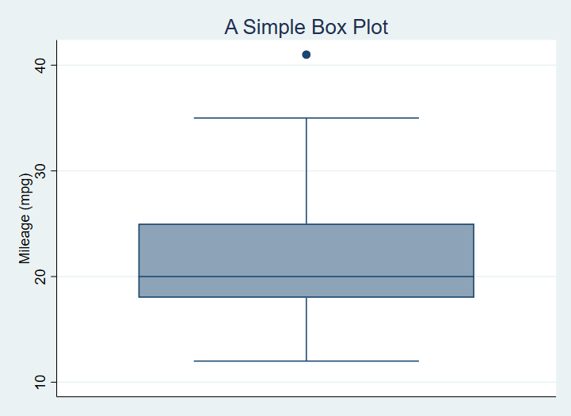

# Intro 

Stata graphing is **easy** if you use the interactive graph editor.

Stata graphing is **hard** if you script. The documentation is exhaustive and highly structured. And a complete rabbit hole. The cheatsheet is a great help!

You should script because graphs that are scripted are

-   repeatable;
-   modifiable;
-   programmatically exportable to Word, HTML and so on.

The problem is remembering both the huge variety of options available (1,700?) to what are at base a small number of basic graphing commands, and knowing which options can apply to which graph types. I haven't mastered either of these issues.

The [cheat sheets](https://www.dropbox.com/s/689lovb5vf5meyt/statacheatsheets.pdf?dl=0) really help.

<https://www.dropbox.com/s/689lovb5vf5meyt/statacheatsheets.pdf?dl=0>

Instead, I want to show you some simpler and then some slightly more complicated graph scripts with explanations of the options and then explain how to export your output to reports.

You should book mark [the Stata graph gallery](https://www.stata.com/support/faqs/graphics/gph/stata-graphs/).

## What will you learn?

We will cover some basic graph editing using the graph editor/menus, just to get an idea of what Stata graphs can look like and some of the options we can change.

We will then cover creating and modifying graphs in scripts including adding adornment to graphs, such as titles, subtitles, notes and captions, modifying appearance such as the shape and colour of markers and using `by()`, `over()` and `separate` to produce faceted graphs and subplots and to selectively modify graph objects.  You will also be introduced to the very basics of Stata's graph schemes.

Finally you will learn the effective way to export graphs from scripts to Word documents and how to create several graphs and export them in a script loop.

So, first, we will look at using the graph editor to understand the alternative to scripting.

# Exercise

## Organise your work

Make a project folder for the work you will do in this session.

Change to the project folder so that it is the current, working directory.

Make a graphs (or images, or charts) folder to save the graphs you create.


Import the data from

```
https://www.ucl.ac.uk/~ccaajim/medtrial.csv"
```
using the Stata procedure `import delimited`.  

Use the following code to add value labels to the variable `gender`:

```
 label define genderl 1 "Male" 2 "Female"
 label values gender genderl
```

Use the commands `desc` and `codebook` to examine the data set.  

## Read before doing the next exercise tasks!

You will need to do some research on how to **encode** string variables and on how to produce a pie chart from the levels of a single variable.  All the information you require is in Stata help.

You will benefit from installing the user-contributed code **catplot** from SSC to make bar plots.

Use the Stata `grahics` menu to make the following plots:

 - a pie chart of frequencies of `gender`
 - a bar chart of frequencies of `smoker`
 - a histogram of `hbefore`
 - a histogram of `hafter` with subplots by `gender`

For the last of these, with the graph window open, open the graph editor and change the colour of the bars (plotregion 1, plot 1) and the bar borders to reddish.  Save the plot to a `png` file.

# Basic types of Stata graph

 - twoway plots
    * scatterplots;
    * line plots;
    * fit plots;
    * fit plots with confidence intervals;
    * area plots;
    * bar plots;
    * range plots;
    * distribution plots
  - scatterplot matrices
  - bar charts
  - box plots
  - dot plots
  - pie charts

# The basic `graph` command and some simple examples

The most basic command for creating graphs and charts in Stata is `graph`. This command has a number of sub-commands and options. The major sub-commands describe different varieties of plot - such as twoway, box plot, and the sub-types of twoway such as scatter and line. (For some reason there is also a small collection of graphs that are independent of either `graph` or `twoway` including `histogram`.)

# Exercise

Create a new do file and add the following lines of code:

```
sysuse auto, clear
hist mpg
```


Open the graph editor and change the backgroud colour of the graph.

# Creating a graph adding elements and changing defaults: box plot examples

Next an equally simple box plot:

`graph box mpg`


# Exercise

Using the data in the file `medtrial.csv` on **https://www.ucl.ac.uk/~ccaajim/", create a box plot of the variable `hafter`.

Use the option `nooutsides` to block the graphing of extreme values.

# Adornments

This graph has no options specified. We begin by specifying a Title. When creating a graph from a script, it makes code easier to read if each option is on a separate line, and if we indent options. To break a command over more than one line in a Stata do file, we must use the line extender code: `///`.

    sysuse auto

    graph box mpg, ///
      title("A Simple Box Plot")



Now, we add a sub-title, caption and a note on the graph with instructions for position and ring:

    sysuse auto
    
    graph box mpg, ///
      title("A Simple Box Plot", position(12) ring(1)) ///
      subtitle("There is only one group in this graph.", ring(0)) ///
      note("In later graphs we will subset the data.") ///
      caption("This is the caption or our first graph.")


The `position` option is a clock number and `ring` is 0 or 1, indicating inside or outside the plot region.

# Exercise

Using the medtrial data set, create a box plot of each of hbefore and hafter.

Add to each the title "Plasma concentrations of H", with the appropriate subtitle indicating whether the measure is pre or post treatment.

# Subset the data

No we subset the data using the categorical variable `foreign`.

    graph box mpg, ///
      title("A Simple Box Plot", position(12) ring(1)) ///
      note("In later graphs we will subset the data.") ///
      caption("This is the caption for our first graph.", ring(1)) ///
      subtitle("There are two groups in this graph.", ring(0)) ///
      over(foreign)


Which produces[^1]

[^1]: Remember to distinguish **by()** and **over()**.


We can modify this to exclude the ticks and grid lines - since this is a box plot we are only modifying the **y-axis** grid lines since no grid is the default for the **x-axis**.

    sysuse auto

    graph box mpg, ///
      title("A Simple Box Plot", position(12) ring(1)) ///
      note("In later graphs we will subset the data.") ///
      caption("This is the caption for our first graph.", ring(1)) ///
      subtitle("There are two groups in this graph.", ring(0)) ///
      over(foreign) ///
      ylabel(,nogrid noticks) ///
      asyvars 
	  
which produces


This also introduces the use of `asyvars` with `over()`.  This option chooses the first listed variable in `over()` as the factor for grouping.  

# Exercise

Produce one graph showing box plots for `hbefore` and `hafter` with appropriate title, for each level of `gender` and differentiating the groups using color.

# Exercise

Run the following lines of code from a new do file

```
gen surname2 = surname if smoker=="Y"
scatter hbefore hafter , mlabel(surname2)
```
Change the code so that the points are labelled only where `gender` is male.

# Standardising your graphing options

using variables, `graph_opts` and `graph_opts_1` as examples, to standardize output.

https://dimewiki.worldbank.org/Stata_Coding_Practices:_Visualization

```
// For -twoway- graphs
global graph_opts ///
  title(, justification(left) color(black) span pos(11)) ///
  graphregion(color(white)) ///
  xscale(noline) xtit(,placement(left) justification(left)) ///
  yscale(noline) ylab(,angle(0) nogrid) ///
  legend(region(lc(none) fc(none)))

// For -graph- graphs
global graph_opts_1 ///
  title(, justification(left) color(black) span pos(11)) ///
  graphregion(color(white)) ///
  yscale(noline) ylab(,angle(0) nogrid) ///
  legend(region(lc(none) fc(none)))
```
Then use as in the following example

```
sysuse auto.dta , clear

scatter price mpg, ///
  ${graph_opts}
  graph draw , ysize(7)
  graph export "scatter.png" , width(4000)
```


# Horizontal bars

We can switch to horizontal boxes with

    sysuse auto, clear

    graph hbox mpg, ///
     title("A Simple Box Plot") ///
     subtitle("There are two groups in this graph.") ///
     over(foreign)

And now we will introduce color by factor variable levels. Note that the command that achieves this, `asyvars`, is technically instructing Stata to treat each level the first grouping variable as a separate y axis variable.

    sysuse auto, clear

    graph box mpg, ///
      title("A Simple Box Plot") ///
      subtitle("There are two groups in this graph.") ///
      over(foreign) ///
      asyvars 


Here is the code for a graph with custom colours set for several of the plot regions.

    graph box mpg, ///
      title("A Simple Box Plot") ///
      subtitle("There are two groups in this graph.") ///
      over(foreign) ///
      asyvars ///
      graphregion(fcolor(gs13)) ///
      plotregion(fcolor(cranberry)) ///
      plotregion(icolor(ltblue))

Produces


Here is the chart with some of the regions labelled with relevant code:


It is worth noting that the undocumented command `bgcolor` appears to override custom color specifications, thus

    graph box mpg, ///
      title("A Simple Box Plot") ///
      subtitle("There are two groups in this graph.") ///
      over(foreign) ///
      asyvars ///
      bgcolor(white)
      graphregion(fcolor(gs13)) ///
      plotregion(fcolor(cranberry)) ///
      plotregion(icolor(ltblue))


# Adding elements and changing defaults: scatter plot examples

First the most basic scatter plot of two continuous variables:

    sysuse auto

    scatter mpg weight

This using Stata defaults produces:


In the next version, we first of all `separate` the mpg values into groups based on the `rep` variable. 
The **?** in `mpg?` below is a wildcard for the numeric suffix of the list of mpg variables created by separate.


We also change the markers, but note we must add **msymbol()** specifications for each group.

    sysuse auto, clear
    separate mpg, by(rep)
    
    scatter mpg? weight, ///
    msymbol(O D T S X) ///
    title("Miles per gallon as a function of Weight") ///
    subtitle("Showing a plausibly strong, negative relationship") ///
    plotregion(fcolor(bluishgray))


# Exercise

Using the medtrial data, seperate the data in `hafter` by `smoker`.  Make a scatter plot of the new `hafter?` variables against `hbefore`.

Apply different marker symbols to the two data groups.  Add an appropriate title.

# Using a Stata graph scheme

A Stata graph scheme is a collection of pre-determined choices you can apply easily to any Stata graph. All aspects of the appearance can be controlled from the scheme.

There are a number of built-in schemes available and there are also user contributed schemes.

In the code below, I apply the scheme `plottig` from the scheme package `blindschemes` which I have previously installed in Stata with the command

    ssc install blindschemes, replace all

Now the graph code:

    sysuse auto

    graph box mpg, ///
      title("A Simple Box Plot") ///
      subtitle("There are two groups in this graph.") ///
      over(foreign) ///
      asyvars ///
      scheme(plottig)

And the result:


This scheme is heavily inspired by the default appearance of graphs produced by `ggplot2`.

And here is a scatter plot with the `plotplain` scheme applied and the legend cleaned up a bit by applying variable labels:

    sysuse auto, clear

    separate mpg, by(rep)

    label variable mpg1 "Fuel Consumption1"
    label variable mpg2 "Fuel Consumption2"
    label variable mpg3 "Fuel Consumption3"
    label variable mpg4 "Fuel Consumption4"
    label variable mpg5 "Fuel Consumption5"

    scatter mpg? weight, ///
        msymbol(O S D T X) ///
        title("Miles per gallon as a function of Weight") ///
        subtitle("Showing a plausibly strong, negative relationship") ///
        plotregion(fcolor(bluishgray)) ///
        scheme(plottig)


Once you are familiar with using schemes and with the graph options you may consider using [these guidelines to modify a scheme to suit your own preferences](https://medium.com/the-stata-guide/stata-schemes-5ef99d099585 "guidelines to modify a Stata graph scheme.").

# Exporting the graph to Word from your script

The following code creates a box plot with a variety of options set, and saves the output as part of a Word document also created by the script.

    sysuse auto, replace
    cd "c:\Users\DELL\Documents\Data\Stata\TablesTutorial\StataGraphing\"
    putdocx clear
    putdocx begin

    // Create paragraphs
    putdocx paragraph
    putdocx text ("Create and embed your graph"), style(Heading1)
    putdocx paragraph
    putdocx text ("This is a graph created by a script and exported to Word.")

    // Embed a graph
    graph box mpg, ///
      title("A Simple Box Plot") ///
      subtitle("There are two groups in this graph.") ///
      over(foreign) ///
      asyvars ///
      graphregion(fcolor(gs13)) ///
      plotregion(fcolor(cranberry)) ///
      plotregion(icolor(ltblue))
      
    graph export "C:\Users\DELL\Documents\Data\Stata\TablesTutorial\StataGraphing\mgpbox7.png", as(png)

    putdocx image "C:\Users\DELL\Documents\Data\Stata\TablesTutorial\StataGraphing\mgpbox7.png"

    putdocx save myreport.docx, replace

As you continue to create visualistions you can change the otpion on `putdocx save` from `replace` to `append`.

# Creating and exporting several graphs in a loop

There are often situations when we wish to create identical graphs for a number of variables or the same variable over or by different factors.  In this case we can use a loop structure and a local macro in Stata to do the job for us.

Consider the code:

```
import delimited "https://www.ucl.ac.uk/~ccaajim/results.csv", clear

local exams "maths english history"

foreach exam in `exams' {
	graph box `exam' 
	graph export  "`exam'.png", replace
}
```

This code takes three variables from a data set and in a `foreach` loop creates then exports a boxplot of that variable.

The code should be easily modifiable and in may circumstances will considerably reduce the number of lines of code written.